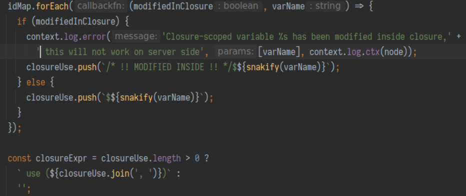

### Функции и области видимости

С функциями дело обстоит несколько сложнее из-за неявного просачивания переменных из 
внешней области видимости. В PHP это должно делаться явным образом - мы всегда обязаны
объявлять переменные замыкания через инструкцию use() примерно следующим образом:


Выяснение списка переменных замыкания, которые используются в нижележащем скоупе - 
это только первый прикол. Второй и гораздо более страшный прикол заключается в том,
что в JS переменные внешнего скоупа доступны по ссылке, тогда как в PHP мы можем
выбирать как передавать переменную - по значению или по ссылке, добавляя к ней
явный амперсанд в конструкции `use()`.

В случае если вы можете себе позволить передавать значение по ссылке всегда - это
прекрасный выход. В ином случае (например, если вы работаете в ВК и у вас KPHP) -
приходится чем-то жертвовать, например требовать, чтобы все транспилируемые функции
были условно чистыми - т.е. могли читать из внешнего скоупа, но не могли в него писать.
Такое в целом несложно задетектить при транспиляции и выдать соответствующее 
предупреждение.

Есть кстати и другой интересный выход, правда применимый только для тех функций, 
которые находятся в скоупе модуля. Вместо того, чтобы передавать переменные через
замыкание, можно породить целый класс модуля, а переменные скоупа модуля сделать
членами класса. Тогда к ним можно будет обращаться через `$this` независимо от того,
насколько глубоко они вложены внутрь других функциональных вызовов. Кроме того,
снимается также и ограничение на их модификацию! Выглядеть это может как-то так:


Как может быть устроен сбор переменных для передачи в замыкание?

Во-первых, нам нужно понимать, когда мы входим в область другой функции и когда мы
выходим из нее. Поскольку вложенность может быть произвольной, нам понадобится
стекообразная структура, лучше всего подойдет дерево - поскольку функций в одной и 
той же области может быть объявлено более одной.


Во-вторых, нам нужно регистрировать объявления переменных, чтобы обработать 
потенциальный shadowing. В том числе мы должны всегда регистрировать объявления 
параметров функции, включая те, которые разыменовываются прямо в сигнатуре.

В-третьих, использование переменных нужно искать во всем стеке начиная с нижнего 
уровня, таким образом если идет обращение к переменной во внешней области - нужно
помечать эту переменную как пробрасываемую в замыкание.



Примерно так генерируется `use()`-выражение, содержащее список переменных для замыкания.
Можно увидеть также обработку модифицируемых внутри переменных - это не будет работать
на сервере, поэтому мы выдаем ошибку. Флаг модификации выставляется довольно сложной
логикой в обработчике идентификаторов (включающей как использование переменных в левой
части присваивающих выражений, так и использование переменных в мутирующих методах), 
поэтому мы его опустим для простоты.

### Вывод типов и обработка стандартных функций

Как мы будем поддерживать функции стандартных объектов? Самое простое - в обработчике
типа `CallExpression` смотреть, является ли вызываемое выражение объектом
`PropertyAccessExpression` и если да - смотреть на его последний элемент, который
должен быть в списке поддерживаемых транспилятором стандартных функций.

Но что будет если мы захотим транспилировать код наподобие такого?

```typescript
let arr = [1, 2, 3];
let arrInc = arr.includes(2);

let str = '12345';
let strInc = str.includes('2');
```

Беда тут заключается в том, что как `Array`, так и `String` содержат метод `includes`
в прототипе, и однозначным образом перевести этот код становится невозможно. Но тут
к нам на помощь спешит вывод типов: мы всегда можем узнать тип объекта, у которого
мы дергаем `includes`.


Соответственно, если это строка, мы переводим вызов в `strpos`, в ином случае - 
в `in_array`. Заметим, что дополнительных проверок мы при этом можем и не делать - 
мы предполагаем, что исходный код синтаксически корректен и typescript проверил,
что у объекта есть метод `includes`. С учетом предположения, что мы не поддерживаем
перевод классов, все выглядит достаточно просто, в ином случае нам понадобилось бы 
еще проверять, что объект принадлежит к “массивным” типам - это тоже поддерживается
в тайпчекере, хоть и немного сложным образом.

[Далее: Уничтожение неиспользуемого кода](unused-code-elimination.md)
