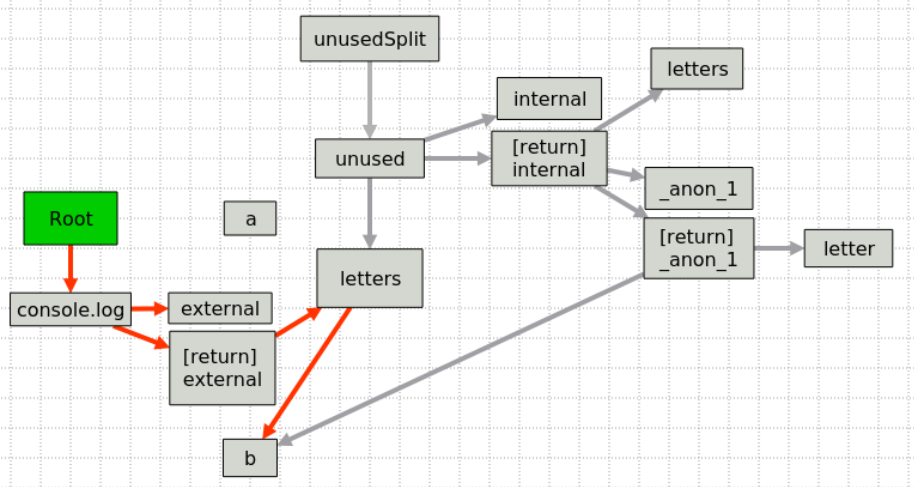

### Неиспользуемый код и как с ним бороться

В некоторых случаях у нас может появиться некоторый код, который на сервере не имеет 
смысла. Например, вы написали сложный обработчик `onClick` в реакт-компоненте, но
очевидно, что на сервере у нас никакой интерактивности нет, следовательно:
- Не нужно присвоение обработчика
- Не нужен его исходный код
- Не нужны все зависимости (переменные, функции), от которых зависит обработчик
- Не нужны все зависимости этих зависимостей… и так далее

Дело усложняется тем, что некоторые переменные и функции могут все же использоваться
для начального рендеринга, и тогда их удалять нельзя. Что делать в таком случае?

Очевидно, что нужно составить граф вызовов и использований идентификаторов. Для начала
этот граф нужно, собственно, составить. И это можно сделать на основе уже имеющегося 
механизма обработки замыканий:
- Всегда существует корневой узел, соответствующий области видимости модуля.
- Объявление функции (в том числе анонимной) или переменной (в том числе параметра 
  функции) будет порождать узел графа
- Узел будет автоматически привязываться ребром к вышележащей области видимости.

Далее нужно понять, какие переменные и функции мы действительно используем. В каком
случае идентификатор считается используемым?
- Если это переменная - все просто, любое использование этой переменной в любом 
  контексте должно выставлять идентификатору переменной флаг used. Если это доступ 
  к свойству объекта - используемым помечается самый верхний идентификатор в
  `PropertyAccessExpression`
- Если это функция - все становится интереснее. Во-первых, мы должны пометить сам 
  идентификатор функции как **used**. Во-вторых, все аргументы функции тоже должны быть
  помечены как **used**.

С такой схемой возникает ряд вопросов:
- Но что если переменная только объявлена, но больше нигде не используется?
- Но что если у нас объявлена функция, которая передается в качестве коллбэка 
  например в обработчик `onClick`? Тогда и сама функция, и все ее аргументы, не
  должны помечаться как **used**.

Вопрос серьезный и решается он привязкой признака используемости возвращаемого значения
к тому контексту, в котором он используется. При этом когда мы парсим и обрабатываем
саму функцию, нам нужно где-то хранить список переменных, которые ей нужны для 
корректного исполнения и выдачи результата.

На этот случай приходится внедрять фиктивные узлы - назовем их узлами возврата. Узел 
возврата создается автоматически для каждой функции, и все переменные, участвующие в
любой конструкции return привязываются к этому узлу, как зависимые.

Таким образом мы приходим к схеме, определяющей используемость переменных на основе 
того, к каким другим конструкциям они привязаны. Если вся конструкция не используется,
переменные также можно отбросить.

Другими словами, поначалу мы строим граф вообще всех переменных и функций. Каждая 
функция и переменная ребром привязана к своему контексту, например в выражениях типа
`const a = b + c`. Мы должны сделать переменные `b` и `c` зависимыми от переменной `a`,
т.е. провести однонаправленное ребро от `a` к `b` и `c`.

Вторым этапом у нас идет обход графа начиная от корневой вершины. Каждый узел,
попавший в обход, помечается как используемый.

Третьим этапом уже идет непосредственно кодогенерация - и те выражения, которые не
были помечены при обходе, мы вправе просто отбросить.

Звучит просто, но на деле возникает масса нюансов. Например, одним из нюансов будет
разница между контекстом определения функции (это там где мы определяем попадающие
в замыкание переменные) и контекстом ее вызова - ведь мы можем функцию передать в 
произвольное количество мест, как используемых, так и потенциально неиспользуемых. 
Здесь нам опять помогут наши фиктивные узлы возврата, которые можно свободно делать
зависимыми от того контекста (переменной или функции), которые используют возвращаемое
значение нашей функции.

Рассмотрим процедуру на простом примере.
```typescript
const a = 'test';
const b = 'used';

const internal = (letters: string[]): string => {
    return letters.map((letter) => '1' + b + letter).join();
};

function external() {
    const letters = b.split('');
    
    const unused = internal(letters);
    const unusedSplit = unused.split('');
    
    return letters;
}

console.log(external());
```
Допустим у нас есть такой код. Какой граф мы получим на первом этапе?


Теперь запускаем обход направленного графа начиная с корневого узла…



Получаем следующую картину из используемых узлов


И наконец отбрасываем лишнее:


Граф значительно упростился, и код на выходе из-за этого получится также гораздо
короче, и что самое главное - в нем не будет ничего лишнего.

Заметим, что в случае, если функция передается в качестве коллбэка в другую функцию
(например, в `map`), ее узел возврата будет присоединен к тому же выражению, что и 
идентификатор функции.

Тут должен возникнуть вопрос - а зачем нам вообще две сущности - и идентификатор
функции, и ее фиктивный узел возврата?
Дело тут в том, как парсятся скрипты - а парсятся они строго последовательно. И 
например, у нас может возникнуть ситуация, когда идентификатор функции используется
еще до ее объявления (function declaration hoisting). В этом случае мы прицепляем 
именно идентификатор функции в качестве зависимости, а дальше, когда парсинг дойдет
до объявления функции, автоматически прицепляем ее фиктивный узел возврата к тем же
узлам, которые использовали идентификатор функции.

В такой постановке вопроса получается, что мы не сразу формируем полный граф согласно
его связям, а постоянно дополняем его, и в случае hoisting-а, можем дополнить его 
дополнительными ребрами в тех областях, которые мы уже распарсили и обработали.
